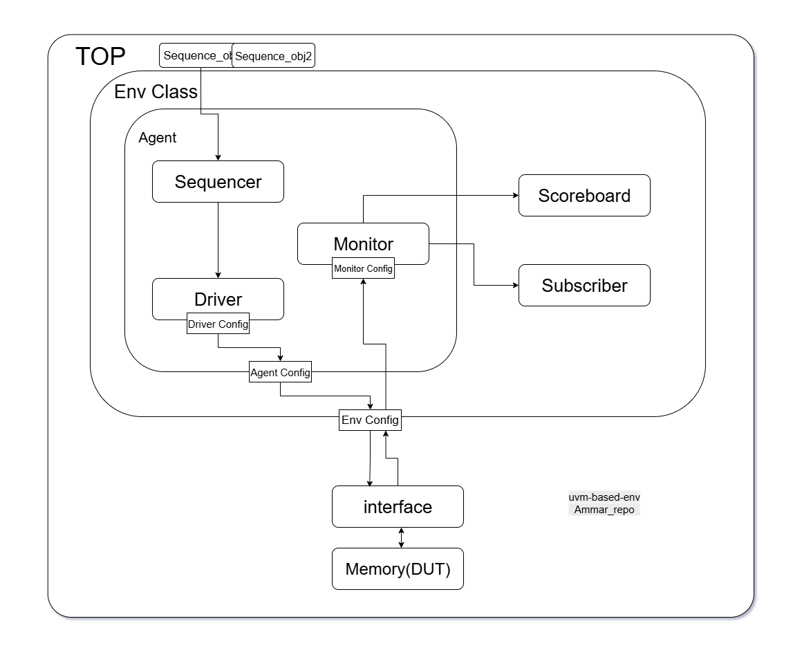
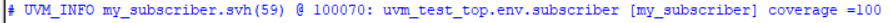
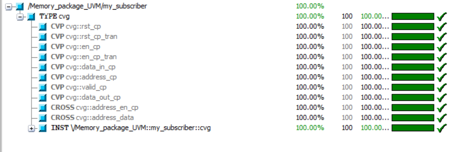

# Memory UVM Based Environment Verification

UVM-based verification project for Verilog memory module. Includes interface, driver, monitor, scoreboard, and sequences to test read/write operations with both directed and random scenarios, ensuring correct data storage, retrieval, and validation of functional behavior.

---

## RTL
### Memory

## Environment

## Coverage 

